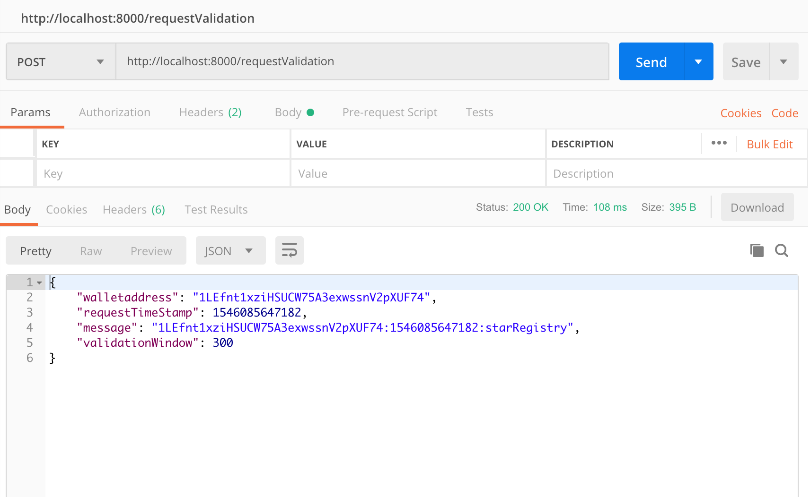
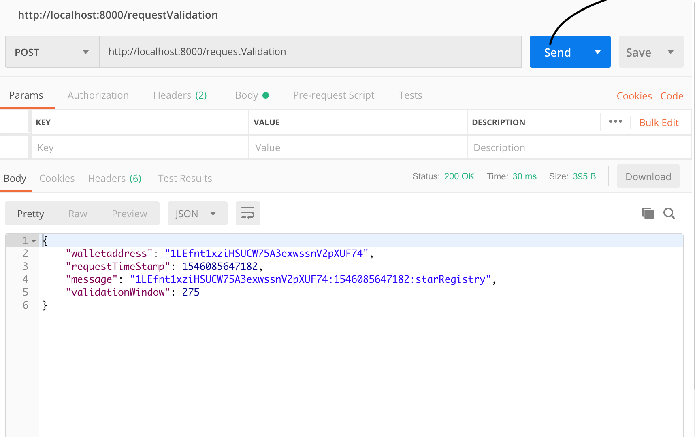
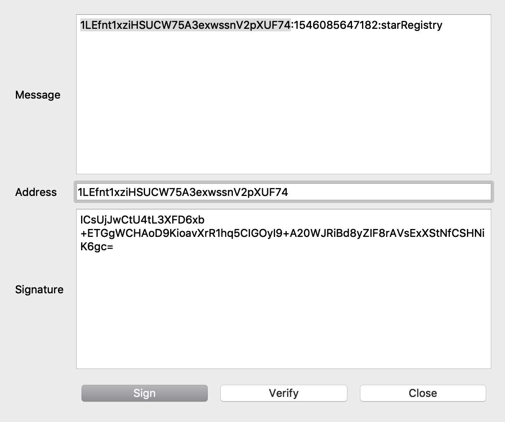
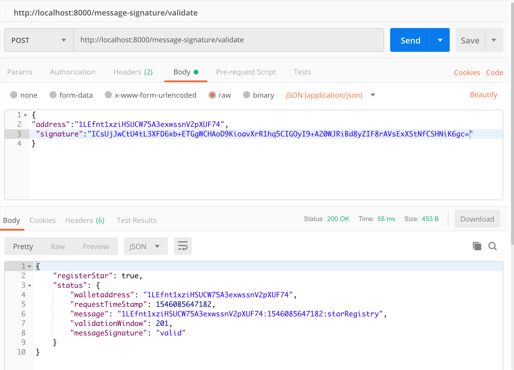
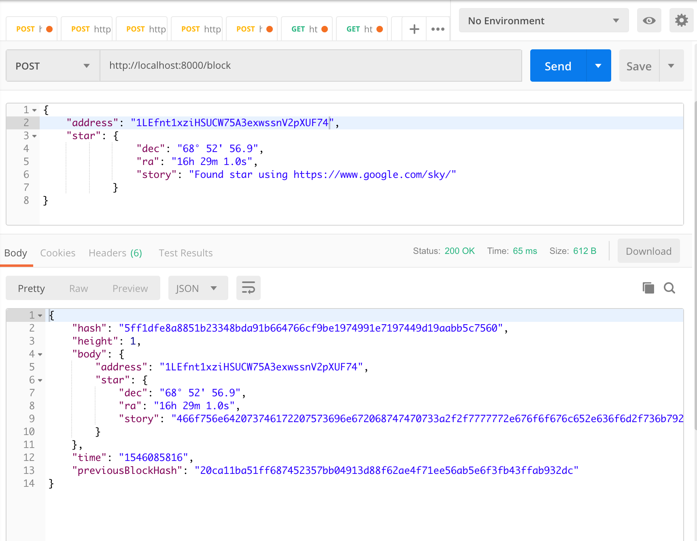
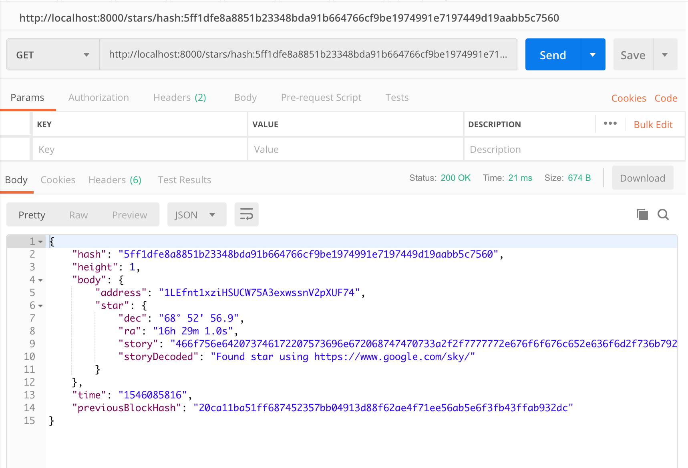
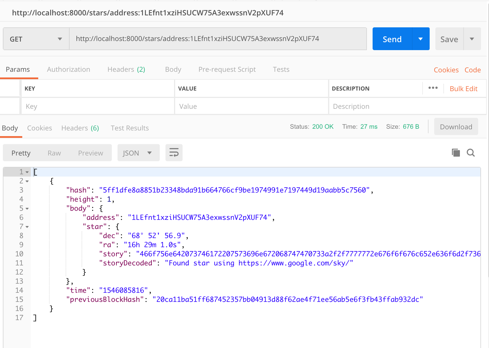
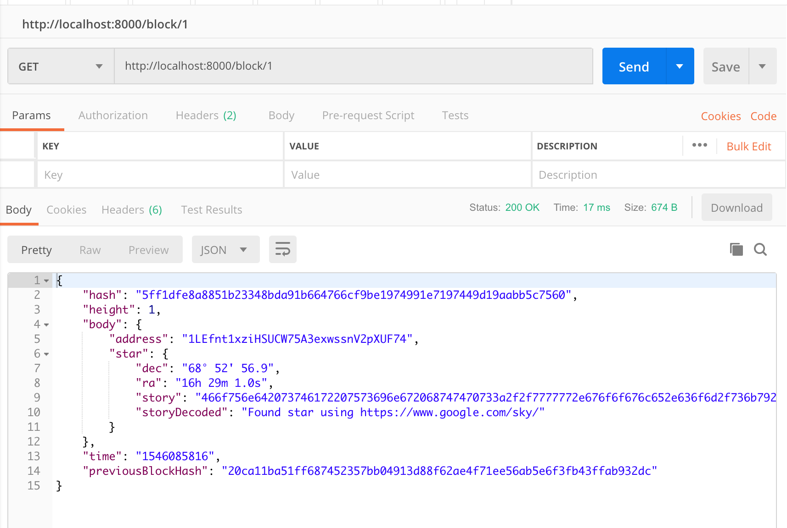
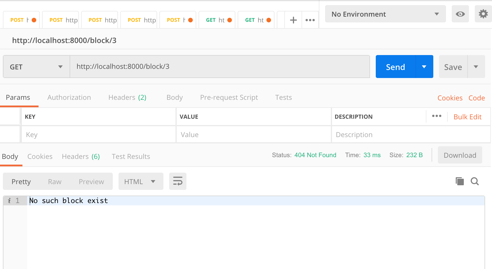

# Project #4. Blockchain Notary Service

This is Project 4 on Blockchain Nanodegree, as a part of this project a Private Blockchain Notary Service has been built and the Following endpoints are exposed

1. POST /requestValidation - to validate request with JSON response.

2. POST /message-signature/validate - to validate message signature with JSON response.

3. POST /block - to submit the Star information to be saved in the Blockchain.

4. GET /stars/hash:[HASH] - to get Star block by hash with JSON response.

5. GET /stars/address:[ADDRESS] - to get Star block by wallet address (blockchain identity) with JSON response.

6. GET /block/[HEIGHT] - to get star block by star block height with JSON response.

## Setup project for Review.

To setup the project for review do the following:
1. Download the project.
2. Run command __npm install__ to install the project dependencies.
3. Run command __node app.js__ in the root directory.

## Implementation

1) This Project uses Express JS framework !

2) APIs are exposed in 8000 port

## Testing the project

The files __app.js__  -> __memPoolValidation.js__ -> __simpleChain.js__ in the root directory has all the implementation logics to be able to test the project, please review the comments in the file.

core implementation below

### POST /requestValidation

[requestValidation();](./app.js#L40)
        
Validation Request

Validation Window reduces as the same request is triggered.

### POST /message-signature/validate

[signatureValidate();](./app.js#L80)
        
Creating message signature using electrum

Validate message Signature

### POST /block

[addStarInfo();](./app.js#L134)
        
Adding Star Information

### GET /stars/hash:[HASH]

[getStarsbyHash();](./app.js#L180)
        
Get stars by Hash

### GET /stars/address:[ADDRESS]

[getStarsbyAddress();](./app.js#L196)
        
Get stars by Hash

### GET /block/[HEIGHT]

[getStarsbyHeight();](./app.js#L214)
        
Get stars by Hash

Validation in case if the block does not exist

## What did I learn with this Project

* I was able to Leverage the previous project experience to persist the Blockchain data in LevelDB
* I was able to Use node framework ( ExpressJS in this case ) to create a REST API for the basic create and retrieve operations.
* I was able to extend the previous project with notary service implementation.

